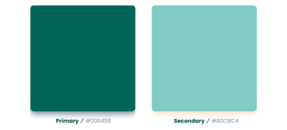
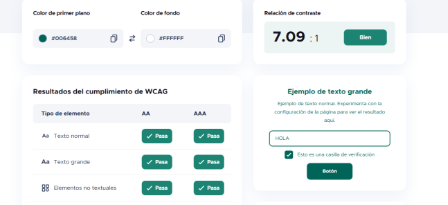
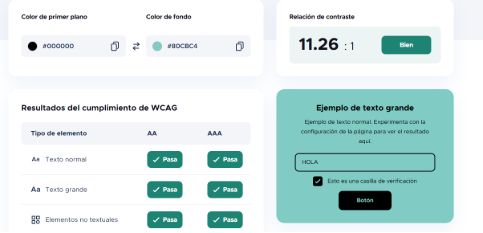
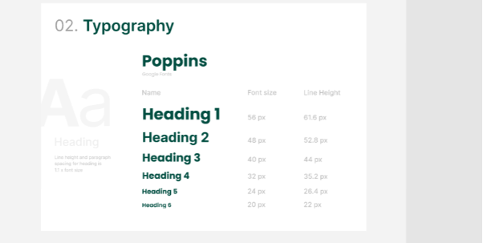
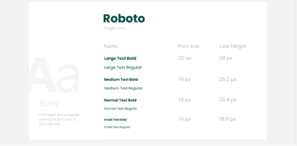
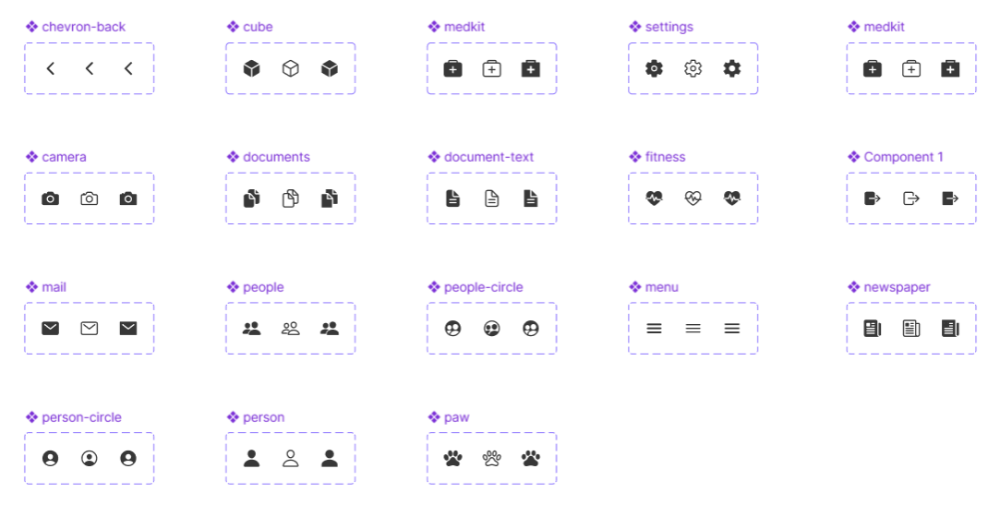

## Design System

**9.1 Justificación de color**

Como color primario hemos elegido el Verde Bosque Oscuro, que transmite confianza, experiencia y solidez. Su profundidad lo ancla al concepto de salud y profesionalismo médico.
Se ha utilizado principalmente en Elementos clave interactivos (botones, títulos importantes).

Mientras que como color secundario hemos elegido el Aguamarina Claro que evoca calma, limpieza y frescura. Sirve para suavizar la interfaz y reducir la ansiedad visual.
Se ha utilizado en fondos de secciones, tarjetas de contenido, banners informativos, espacios destacados

\

Texto Principal: Negro (#000000) sobre fondos claros para máxima legibilidad.

Fondos: Blanco para la mayoría de las áreas de contenido, transmitiendo higiene y limpieza.

Botones: Se utiliza el Verde Principal (#006458) para el fondo y blanco (#FFFFFF) para el texto dirigiendo la atención del usuario.

Prueba de contraste de color principal y secundario:

\

**Otros colores importantes:**

| Estado                | Color Hex | Color (Aprox.)    | Uso Principal en la Interfaz (UI)                                                              | Justificación de Usabilidad                                                                                                                        |
|-----------------------|-----------|-------------------|------------------------------------------------------------------------------------------------|----------------------------------------------------------------------------------------------------------------------------------------------------|
| Success (Éxito)       | #4CAF50   | Verde Menta       | Señalización de acciones exitosas, guardado de datos, finalización de procesos.                | Es universalmente reconocido para indicar éxito o la conclusión positiva de una tarea para el usuario, generando alivio y confirmación.            |
| Error                 | #E53935   | Rojo Ladrillo     | Señalización de errores en formularios, campos obligatorios, mensajes de fallo crítico.        | Es inmediatamente reconocible para alertar al usuario sobre un problema que requiere atención o corrección.                                        |
| Warning (Advertencia) | #FF9800   | Naranja Brillante | Avisos de precaución, información que requiere revisión, límites de acciones (ej. saldo bajo). | Indica un riesgo potencial o un estado transitorio que no es un error, pero que el usuario debe considerar antes de continuar.                     |
| Info (Información)    | #2196F3   | Azul Primario     | Mensajes de información neutral, pop-ups de ayuda, recordatorios de políticas.                 | Se utiliza para ofrecer información útil y no crítica que complementa la tarea, siguiendo la convención de los sistemas operativos y aplicaciones. |

**9.2 Justificación de tipografía**

**Familia Elegida:** Poppins.

**Justificación:**\
Se ha elegido principalmente por su claridad, lo que minimiza la fatiga visual en la lectura de descripciones de productos. Transmite el aire moderno y funcional de los muebles.

**Accesibilidad (Tamaño):**\
Hemos elegido esta tipografía principalmente para títulos y tiene un tamaño base de 40px y un máximo de 56px asegurando que todo el contenido sea legible. Los títulos (H1) son de 56px, los (H2) son de 48pxm y el resto sigue la misma estructura dejando una diferencia de 8px entre títulos para una jerarquía clara.

\

**Familia Elegida:** Roboto

**Justificación:**\
Se ha elegido principalmente por su excelente legibilidad en pantallas digitales, lo que reduce la fatiga visual durante la lectura de textos extensos, como descripciones de productos o información técnica. Además, su versatilidad permite mantener una coherencia visual en distintos tamaños y dispositivos.

**Accesibilidad (Tamaño):**\
Hemos elegido esta tipografía principalmente para títulos, garantizando una lectura cómoda y una jerarquía visual clara. El tamaño máximo es de 20px, el tamaño normal es de 18px y el pequeño es de 16.

**9.3 Justificación de iconografía**

Hemos adoptado la librería Ionic icons como nuestra fuente estándar y única para todos los elementos gráficos simbólicos de la interfaz.

Ionic icons ofrece un conjunto de iconos unificado bajo el mismo estilo de diseño, asegurando una identidad visual homogénea en toda la aplicación y proporciona iconos universalmente reconocibles que minimizan la curva de aprendizaje del usuario.
Lo que permite que el usuario asocia rápidamente el símbolo con la acción.

Aqui se muestran algunos de los iconos utilizados en la aplicación:

