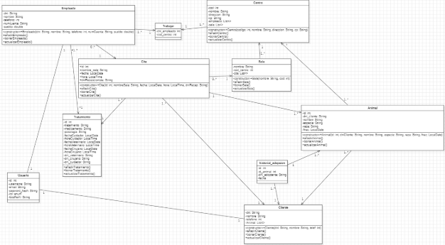

## 10. Diagrama de Clases

Este diagrama muestra un **modelo entidad-relación orientado a clases (UML)** de un sistema de **gestión veterinaria**. A continuación, un resumen de sus partes:

- **Empleado:** contiene los datos del personal (DNI, nombre, teléfono, cuenta, sueldo).  
  Puede añadirse, borrarse o actualizarse.

- **Centro:** representa las sucursales veterinarias (código, nombre, dirección, CP)  
  y se relaciona con los empleados mediante la tabla intermedia **Trabajar**  
  (relación muchos a muchos).

- **Sala:** pertenece a un centro y puede tener varias **Citas**.

- **Cita:** almacena información sobre una reserva (sala, fecha, hora, recepcionista).

- **Tratamiento:** vincula empleados (cuidador, veterinario, cirujano) con un animal  
  y una cita, incluyendo medicamento y posología.

- **Cliente:** contiene datos del propietario (DNI, nombre, teléfono) y tiene una lista de **Animales**.

- **Animal:** guarda los datos del animal (nombre, especie, raza, fecha de nacimiento)  
  y se relaciona con cliente, tratamientos y adopciones.

- **Historial_adopcion:** registra adopciones con las fechas y los DNI de adoptante y animal.

- **Usuario:** gestiona el acceso al sistema (username, email, contraseña, rol, foto de perfil).

