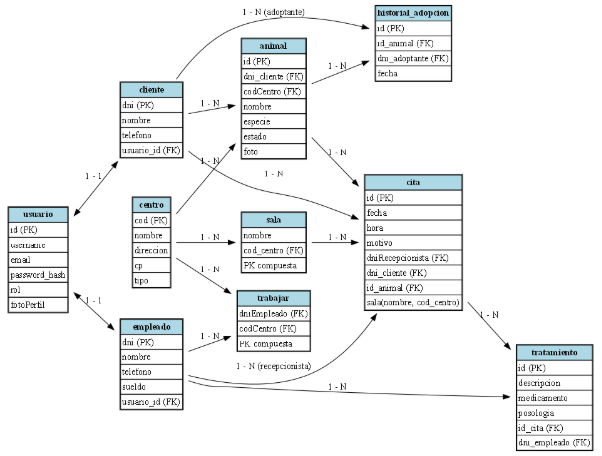

## 8.Justificación del modelo de la base de datos

El modelo de base de datos propuesto se compone de distintas entidades que permiten gestionar la información del centro veterinario y de las adopciones. La entidad “Usuario” centraliza los datos de acceso al sistema y permite controlar los permisos de los distintos tipos de usuarios.

Por su parte, “Cliente” representa a las personas interesadas en adoptar o que ya poseen animales, y se vincula directamente con un usuario del sistema.

La entidad “Empleado” identifica al personal del centro, como veterinarios o recepcionistas, también asociados a un usuario para gestionar sus accesos.

“Centro” define las instalaciones donde se albergan los animales y se realizan las adopciones, mientras que “Sala” tiene una clave primaria compuesta por el nombre y el código del centro y se encarga de definir el lugar donde suceden las citas.

“Animal” almacena los datos esenciales de cada animal y se relaciona tanto con el cliente al que pertenece como con el centro en el que se trata y con historial adopción por si es un animal adoptado.

“Historial\_Adopcion” registra las adopciones pasadas, asegurando la trazabilidad de cada animal a lo largo del tiempo.

Las entidades “Cita” y “Tratamiento” permiten gestionar la atención veterinaria y registrar los medicamentos, posología y responsables de cada procedimiento, mientras que “Trabajar” representa la asignación de los empleados a uno o varios centros.

En cuanto a las relaciones y cardinalidades, se establece una correspondencia uno a uno entre “Usuario–Cliente” y “Usuario–Empleado”, ya que cada persona tiene un único usuario del sistema.

` `La relación “Cliente–Animal” es de uno a muchos, puesto que un cliente puede tener y/o adoptar varios animales. Cada “Animal” pertenece a un único “Centro”, y cada “Centro” puede tener múltiples “Salas”, formando una relación uno a muchos.

La relación entre “Empleado” y “Centro” es de muchos a muchos, gestionada mediante la entidad intermedia “Trabajar”, que permite que un empleado trabaje en diferentes centros y viceversa.

Por su parte, las relaciones “Cita–Animal”, “Cita–Cliente” y “Cita–Empleado” son de muchos a uno, ya que cada cita involucra un animal, un cliente y un empleado, los cuales pueden estar presentes en varias citas.

A su vez, una “Cita” puede tener varios “Tratamientos”, y un “Animal” puede registrar un solo “Historial de adopción”, reflejando que el animal solo se puede adoptar una vez por un cliente.