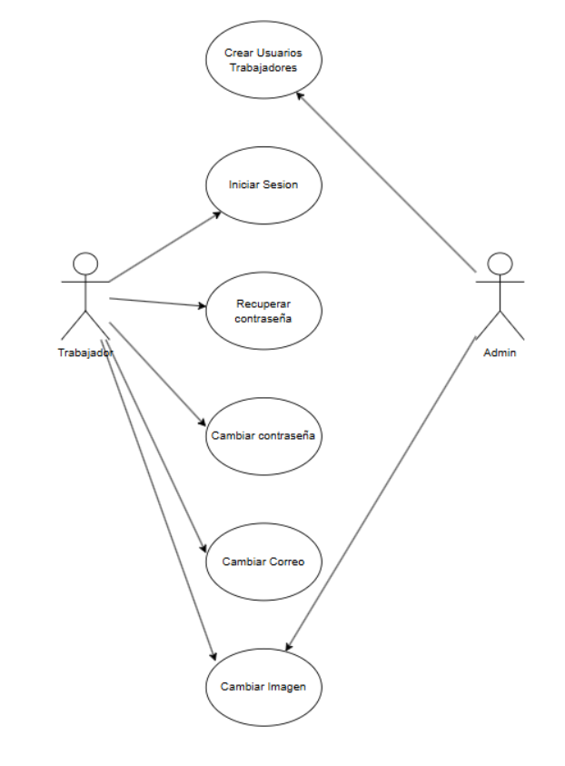
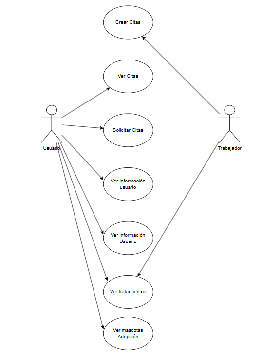

## 7. Casos de uso**

**7.1 Caso de uso Trabajador y Administrador creación de cliente y cita.**

El trabajador puede registrar clientes y sus mascotas, crear y gestionar citas, además de crear salas para asignarlas a dichas citas. También tiene la capacidad de asignar citas a salas o centros y designar trabajadores responsables, lo que le permite organizar de forma eficiente los recursos y la atención dentro del sistema.

El administrador posee funciones de mayor jerarquía, como la creación y gestión de salas con permisos ampliados, así como la posibilidad de registrar nuevos centros o sucursales, definiendo su ubicación, recursos y datos de contacto.

\

**7.2 Caso de uso Trabajador y Administrador creación usuario y sesión.**

Desde la perspectiva del trabajador, este puede iniciar sesión en la plataforma, recuperar o cambiar su contraseña, modificar su correo electrónico y actualizar su imagen de perfil.

El administrador cuenta con la capacidad de crear usuarios trabajadores, lo que le permite gestionar los accesos y mantener actualizado el registro de personal dentro del sistema. En conjunto, estas funciones garantizan un control seguro de las cuentas y la información de los usuarios.

\

**7.3 Caso de uso Usuario y Administrador funciones de usuario.**

Desde la perspectiva del **usuario**, este puede solicitar citas, ver sus citas programadas, consultar su información personal, revisar tratamientos y visualizar las mascotas disponibles para adopción.

El trabajador** tiene la capacidad de crear nuevas citas, visualizar las citas existentes y acceder a la información de los usuarios y tratamientos. En conjunto, estas funciones facilitan la gestión de citas y el acceso a información relevante tanto para usuarios como para trabajadores.

\

